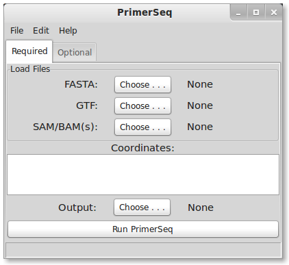
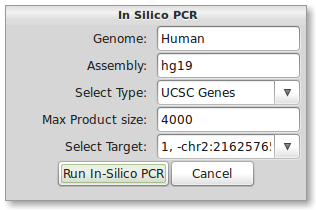
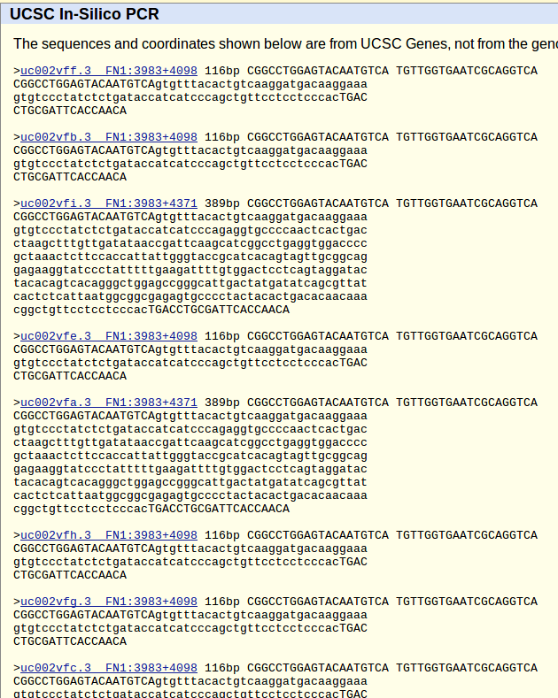



## Installation

PrimerSeq supports three major operating systems (Windows, Mac OS, and Linux). Please follow the instructions
for your OS by clicking the appropriate linke below.

1. [Windows](windows.html)
2. Mac OS (*coming soon ...*)
3. Linux (*coming soon ...*)

## Example

When you start PrimerSeq, you should see a graphical interface similar to the below image, although
aesthetics may differ depending on your OS.

### Loading Data

To load sample data, press <i>File -> Load Ex.</i> in the top menu. The sample data should take only a few seconds to load.
PrimerSeq should now look like the following:

PrimerSeq when data is loaded

 

Notice that a FASTA, GTF, and BAM file is loaded for you in this example. The target exon is also specified in the coordinates
text field. Target exon coordinates are specified, in order, as strand, chromosome, colon, start, dash, and end. In PrimerSeq the first nucleotide
of a chromosome is 0 and end positions are not inclusive.

Next, select the text file where you wish to save the results by pressing the "Choose" button for the output.

### Running PrimerSeq

After selecting an output file, run PrimerSeq by pressing the "Run PrimerSeq" button located near the bottom. A dialog should now
appear indicating that primer design is in progress. Once the primer design is done, the results should appear in a new window.

PrimerSeq Results

 

You may also find the results in a text file where you specified it previously.

## Interpreting Results

### Information

A PrimerSeq result consists of 13 columns, multiple results are separated
by a semi-colon:

1. **ID** - unique identifier
2. **Target Coordinate** - user-specified target exon
3. **Primer Coordinates** - Coordinates of upstream and downstream primer
4. **Psi Target** - Estimated target exon inclusion level based on each BAM file
5. **Upstream Primer** - Upstream primer sequence
6. **Downstream Primer** - Downstream primer sequence
7. **Average TM** - Average of the two primer TMs
8. **Skipping Prod. Size** - Product size(s) for each isoform that does **not** contain the target exon
9. **Inc. Prod. Size** - Product size(s) for each isoform that does contain the target exon
10. **Upstream Exon Coord.** - Upstream exon coordinate
11. **Upstream Psi** - Upstream exon inclusion level
12. **Downstream Exon Coord.** - Downstream exon coordinate
13. **Downstream Psi** - Downstream exon inclusion level

### Visualization

PrimerSeq allows you to visualize the results, providing a quick intuitive check of the primer design. Press the "Create Plots"
button in the results window tool bar. A dialog should now appear. To plot the results, you need to specify a BigWig file and the target 
exon of interest (in this example there is only one). You can find a BigWig file for the example in the PrimerSeq installation
directory `example/chr18_9561977_9563548.bw`. Select the only available option in the "Select Target" drop-down list.

Choose one or multiple BigWig file(s) and then select your target exon

 

Press the "Plot" button to create a plot. If everything worked correctly, you should see the below plot.
Inclusion level estimates in the below plot are based on pooled read counts from all BAM/SAM
file(s) provided.

Plotting of PrimerSeq Results

### In-Silico PCR

As a secondary check for primer design, you can quickly run the In-Silico PCR from
UCSC's genome browser through PrimerSeq. Press the In-Silico PCR button in the tool bar of
the results window. The below dialog should now appear.

In-Silico PCR Dialog

 

The correct input for human hg19 should be present by default. To use other species or
assemblies you will need to look at the naming on the UCSC's [In-Silico PCR webpage](http://genome.ucsc.edu/cgi-bin/hgPcr).
Now select the only available option from the "Select Target" drop-down list.
When ready, press the "Run In-Silico PCR" button. Your default web browser should now
open the results of In-Silico PCR. The result should match the result from the PrimerSeq output.

In-Silico PCR Results

