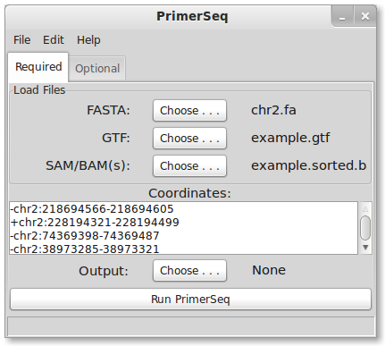
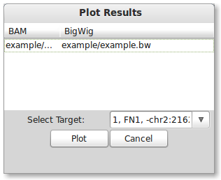



## Installation

PrimerSeq supports three major operating systems (Windows, Mac, and Linux). Please follow the instructions
for your OS by clicking the appropriate below link.

1. Windows
2. Mac
3. Linux

## Example

When you start PrimerSeq, you should see a graphical interface similar to the below image, although
aesthetics may differ depending on your OS.

To load sample data, press <i>File -> Load Ex.</i> in the top menu. The sample data should take only a few seconds to load.
PrimerSeq should now look like the following:

PrimerSeq when data is loaded

Notice that a FASTA, GTF, and BAM file is loaded for you in this example. The target exon is also specified in the coordinates
text field. Target exon coordinates are specified, in order, as strand, chromosome, start, and end. In PrimerSeq the first nucleotide
of a chromosome is 0 and end positions are not inclusive.

Next, select the text file where you wish to save the results by pressing the "Choose" button for the output.

After selecting an output file, run PrimerSeq by pressing the "Run PrimerSeq" button located near the bottom. A dialog should now
appear indicating that primer design is in progress. Once primer design is done, the dialog should disappear. You may find the output
file where you specified it above.

## Visualizing

PrimerSeq allows you to visualize the results, providing a quick intuitive check of the primer design. Press *View -> Plot*
from the menu options. A dialog should now appear. To plot the results, you need to specify a BigWig file and the target 
exon of interest (for the example there is only one). You can find a BigWig file for the example in the PrimerSeq installation
directory `example/chr18_9561977_9563548.bw`. Select the only available option in the 

Choose one of multiple BigWig files and then select your target exon

Press the "Plot" button to create a plot. If everything worked correctly, you should see the below plot.

Plotting of PrimerSeq Results

