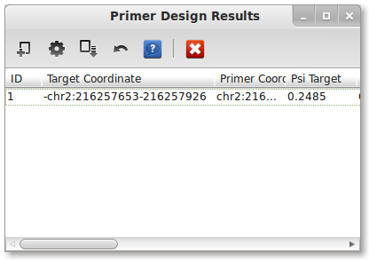



## Installation

PrimerSeq supports two major operating systems (Windows and Linux).
Please follow the instructions for your OS by clicking the appropriate link
below.

1. [Windows](windows.html)
2. [Linux](linux.html)
3. Mac OS (*coming soon ...*)

## Example

When you start PrimerSeq, you should see a graphical interface similar to the
below image, although aesthetics may differ depending on your OS.

### Loading Data

To load sample data, press <i>File -> Load Quick Ex.</i> in the top menu. The sample data should
take only a few seconds to load. The RNA-Seq data is from heart tissue sequenced from Illumina's Human BodyMap 2.0 project.
PrimerSeq should now look like the following:

PrimerSeq when data is loaded

 

Notice that a FASTA, GTF, and BAM file is loaded for you in this example. The
target exon is also specified in the coordinates text field. Target exon
coordinates are specified, in order, as strand, chromosome, colon, start,
dash, and end. In PrimerSeq the first nucleotide of a chromosome is 0 and end
positions are not inclusive.

Next, select the text file where you wish to save the results by pressing the
"Choose" button for the output.

### Running PrimerSeq

After selecting an output file, run PrimerSeq by pressing the "Run PrimerSeq"
button located near the bottom. A dialog should now appear indicating that
primer design is in progress. Once the primer design is done, the results
should appear in a new window.

PrimerSeq Results

 

You may also find the results in a text file where you specified it previously.

## Interpreting Results

### Information

A PrimerSeq result consists of 14 columns, multiple results are separated
by a semi-colon:

1. **ID** - unique identifier
2. **Target Coordinate** - user-specified target exon
3. **Primer Coordinates** - Coordinates of upstream and downstream primer
4. **Psi Target** - Estimated target exon inclusion level based on each BAM file
5. **Forward Primer** - Upstream primer sequence
6. **Reverse Primer** - Downstream primer sequence
7. **Average TM** - Average of the two primer TMs
8. **Skipping Prod. Size** - Product size(s) for each isoform that **does not** contain the target exon
9. **Inc. Prod. Size** - Product size(s) for each isoform that **does** contain the target exon
10. **Upstream Exon Coord.** - Upstream exon coordinate
11. **Upstream Psi** - Upstream exon inclusion level
12. **Downstream Exon Coord.** - Downstream exon coordinate
13. **Downstream Psi** - Downstream exon inclusion level
14. **ASM Region** - Region where alternative splicing events occur
15. **Gene** - gene name as it occurs in the gene annotation (GTF)

### Visualization

PrimerSeq allows you to visualize the results, providing a quick intuitive
check of the primer design. Press the "Create Plots" button in the results
window tool bar. A dialog should now appear. To plot the results, you need to
specify a BigWig file and the target exon of interest (in this example there
is only one). You can find a BigWig file for the example in the PrimerSeq
installation directory `example/example.bw`. Click on the BigWig cell and then type
`example/example.bw`. Next, select the only available option
in the "Select Target" drop-down list.

Type the file path of your BigWig file and then select your target exon

 

Press the "Plot" button to create a plot. If everything worked correctly, you
should see the below plot. Inclusion level estimates in the below plot are
based on read counts from individual SAM/BAM file(s).

Plotting of PrimerSeq Results

 

This example is of a *Skipped Exon* event. Skipped exons happens when a single exon
is either included or not included.

### In-Silico PCR

As a secondary check for primer design, you can quickly run the In-Silico PCR
from UCSC's genome browser through PrimerSeq. Press the In-Silico PCR button
in the tool bar of the results window. The below dialog should now appear.

In-Silico PCR Dialog

 

The correct input for human hg19 should be present by default. To use other
species or assemblies you will need to look at the naming on the UCSC's [In-Silico PCR webpage](http://genome.ucsc.edu/cgi-bin/hgPcr). Leave the In-Silico
PCR type as *UCSC Genes*. Now select the only available option from the
"Select Target" drop-down list. When ready, press the "Run In-Silico PCR"
button. Your default web browser should now open the results of In-Silico PCR.
The result should match the result from the PrimerSeq output.

In-Silico PCR Results

 

You can perform In-Silico PCR on the genome (not shown) instead of UCSC's
transcripts by selecting *"Genome"* from the *"Select Type"* drop-down. This
may be necessary if you are using a GTF file from other sources like Ensembl.
You will need to significantly increase the *Max Product Size* since the
product lengths will include introns.

## Using Multiple Exons

The above example just used one exon. However, PrimerSeq can design primers for
many primers sequentially. In the initial GUI, press *File -> Load Larger Ex.*.
You should see a list of ten exons now instead of just one (*see below*). The same
heart RNA-Seq data from Illumina's Human BodyMap 2.0 project is used like the above example.

Press <i>File -> Load Larger Ex.</i>

 

The "Coordinates" text area now has a list of coordinates for 10 exons. Next, select an
output file and then press the "Run PrimerSeq" button. You should see results for 10 exons
when the primer design is finished (*see below*).

10 Exon Primer Design Results

 

Although you can look at plots and in-silico pcr for each exon, the easiest way is to click the
"Save Plots" button (the third button from the left). This will bring up a dialog as shown below.

Fill in Necessary Information

 

You will need to enter "example/example.bw" as the BigWig file since it is necessary for
displaying read depth. You may also edit the *Title*. Do not change the "Genome" or "Assembly"
text fields. You will, however, need to select a directory to save the results by pressing the
"Choose ..." button. When finished, press the "Generate Report" button. While running, the button
should now say "generating ...". When finished, a web browser should automatically open the results
like shown below.

<iframe src="getting_started_output/index.html" frameborder="0" style="width: 100%; overflow-y: scroll; height:350px; display: block;"> text here </iframe>
 

Notice, you can just click links to see plots and run UCSC's in-silico PCR. Even though the 9th example
exon is a complex alternative splicing event, PrimerSeq designed the primers on **highly included** flanking
exons. This allows primer design for more cases then just simple skipped exon events while simultaneously keeping PCR product lengths reasonable. For detailed instructions on running and configuring PrimerSeq, please read the [user tutorial](user_tutorial.html).
