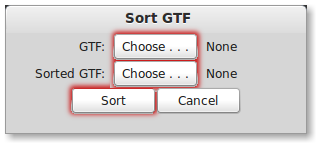
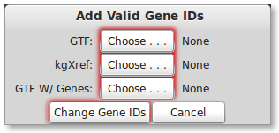



## Overview

The Gene Transfer Format (GTF) is a widely used format for storing gene annotations.
You can obtain GTF files easily from the [UCSC table browser](http://genome.ucsc.edu/cgi-bin/hgTables?command=start)
and [Ensembl](http://www.ensembl.org/info/data/ftp/index.html). For example,
the first few lines of UCSC's gene annotation for hg19 looks like the following:

<pre style="overflow-x: scroll; white-space:nowrap;">
chr1&nbsp;&nbsp;&nbsp;&nbsp;hg19_knownGene&nbsp;&nbsp;exon&nbsp;&nbsp;&nbsp;&nbsp;11874&nbsp;&nbsp;&nbsp;12227&nbsp;&nbsp;&nbsp;0.000000&nbsp;&nbsp;&nbsp;&nbsp;+&nbsp;&nbsp;&nbsp;.&nbsp;&nbsp;&nbsp;gene_id&nbsp;"uc001aaa.3";&nbsp;transcript_id&nbsp;"uc001aaa.3"; 
chr1&nbsp;&nbsp;&nbsp;&nbsp;hg19_knownGene&nbsp;&nbsp;exon&nbsp;&nbsp;&nbsp;&nbsp;12613&nbsp;&nbsp;&nbsp;12721&nbsp;&nbsp;&nbsp;0.000000&nbsp;&nbsp;&nbsp;&nbsp;+&nbsp;&nbsp;&nbsp;.&nbsp;&nbsp;&nbsp;gene_id&nbsp;"uc001aaa.3";&nbsp;transcript_id&nbsp;"uc001aaa.3"; 
chr1&nbsp;&nbsp;&nbsp;&nbsp;hg19_knownGene&nbsp;&nbsp;exon&nbsp;&nbsp;&nbsp;&nbsp;13221&nbsp;&nbsp;&nbsp;14409&nbsp;&nbsp;&nbsp;0.000000&nbsp;&nbsp;&nbsp;&nbsp;+&nbsp;&nbsp;&nbsp;.&nbsp;&nbsp;&nbsp;gene_id&nbsp;"uc001aaa.3";&nbsp;transcript_id&nbsp;"uc001aaa.3"; 
chr1&nbsp;&nbsp;&nbsp;&nbsp;hg19_knownGene&nbsp;&nbsp;exon&nbsp;&nbsp;&nbsp;&nbsp;11874&nbsp;&nbsp;&nbsp;12227&nbsp;&nbsp;&nbsp;0.000000&nbsp;&nbsp;&nbsp;&nbsp;+&nbsp;&nbsp;&nbsp;.&nbsp;&nbsp;&nbsp;gene_id&nbsp;"uc010nxr.1";&nbsp;transcript_id&nbsp;"uc010nxr.1"; 
chr1&nbsp;&nbsp;&nbsp;&nbsp;hg19_knownGene&nbsp;&nbsp;exon&nbsp;&nbsp;&nbsp;&nbsp;12646&nbsp;&nbsp;&nbsp;12697&nbsp;&nbsp;&nbsp;0.000000&nbsp;&nbsp;&nbsp;&nbsp;+&nbsp;&nbsp;&nbsp;.&nbsp;&nbsp;&nbsp;gene_id&nbsp;"uc010nxr.1";&nbsp;transcript_id&nbsp;"uc010nxr.1"; 
chr1&nbsp;&nbsp;&nbsp;&nbsp;hg19_knownGene&nbsp;&nbsp;exon&nbsp;&nbsp;&nbsp;&nbsp;13221&nbsp;&nbsp;&nbsp;14409&nbsp;&nbsp;&nbsp;0.000000&nbsp;&nbsp;&nbsp;&nbsp;+&nbsp;&nbsp;&nbsp;.&nbsp;&nbsp;&nbsp;gene_id&nbsp;"uc010nxr.1";&nbsp;transcript_id&nbsp;"uc010nxr.1"; 
chr1&nbsp;&nbsp;&nbsp;&nbsp;hg19_knownGene&nbsp;&nbsp;start_codon&nbsp;12190&nbsp;&nbsp;&nbsp;12192&nbsp;&nbsp;&nbsp;0.000000&nbsp;&nbsp;&nbsp;&nbsp;+&nbsp;&nbsp;&nbsp;.&nbsp;&nbsp;&nbsp;gene_id&nbsp;"uc010nxq.1";&nbsp;transcript_id&nbsp;"uc010nxq.1"; 
chr1&nbsp;&nbsp;&nbsp;&nbsp;hg19_knownGene&nbsp;&nbsp;CDS&nbsp;12190&nbsp;&nbsp;&nbsp;12227&nbsp;&nbsp;&nbsp;0.000000&nbsp;&nbsp;&nbsp;&nbsp;+&nbsp;&nbsp;&nbsp;0&nbsp;&nbsp;&nbsp;gene_id&nbsp;"uc010nxq.1";&nbsp;transcript_id&nbsp;"uc010nxq.1"; 
chr1&nbsp;&nbsp;&nbsp;&nbsp;hg19_knownGene&nbsp;&nbsp;exon&nbsp;&nbsp;&nbsp;&nbsp;11874&nbsp;&nbsp;&nbsp;12227&nbsp;&nbsp;&nbsp;0.000000&nbsp;&nbsp;&nbsp;&nbsp;+&nbsp;&nbsp;&nbsp;.&nbsp;&nbsp;&nbsp;gene_id&nbsp;"uc010nxq.1";&nbsp;transcript_id&nbsp;"uc010nxq.1"; 
chr1&nbsp;&nbsp;&nbsp;&nbsp;hg19_knownGene&nbsp;&nbsp;CDS&nbsp;12595&nbsp;&nbsp;&nbsp;12721&nbsp;&nbsp;&nbsp;0.000000&nbsp;&nbsp;&nbsp;&nbsp;+&nbsp;&nbsp;&nbsp;1&nbsp;&nbsp;&nbsp;gene_id&nbsp;"uc010nxq.1";&nbsp;transcript_id&nbsp;"uc010nxq.1"; 
</pre>

The columns are tab separated and are defined by the GTF standard specified [here](http://mblab.wustl.edu/GTF22.html).
PrimerSeq only uses the lines with the "exon" feature (column 3) and ignores other lines.

## Be Careful 

If you are particularly observant, you will notice that the above example GTF from UCSC known gene annotation has
the same gene ID as transcript ID. This is because the GTF format requires a gene ID
attribute, so UCSC just fills in a wrong value (the transcript ID).
This example GTF and many GTFs are also not sorted by chromosome and position. PrimerSeq **requires** a **sorted**
GTF as input. For these reasons, if you are using a common annotation I **strongly** suggest you download it from the list
below.

* [Homo_sapiens.knownGene.hg19.sorted.withGenes.gtf](http://sourceforge.net/projects/primerseq/files/GTF/Homo_sapiens.knownGene.hg19.sorted.withGenes.gtf/download)
* [Homo_sapiens.GRCh37.69.sorted.gtf](http://sourceforge.net/projects/primerseq/files/GTF/Homo_sapiens.GRCh37.69.sorted.gtf/download)
* [Mus_musculus.knownGene.mm9.sorted.withGenes.gtf](http://sourceforge.net/projects/primerseq/files/GTF/Mus_musculus.knownGene.mm9.sorted.withGenes.gtf/download)
* [Mus_musculus.GRCm38.69.sorted.gtf](http://sourceforge.net/projects/primerseq/files/GTF/Mus_musculus.GRCm38.69.sorted.gtf/download)

If you feel a widely used annotation is missing, feel free to suggest that I 
include it by [email](mailto:primerseq@gmail.com).

### Sorting a GTF

PrimerSeq also includes the ability to handle such ill-specified GTF files.
For any GTF file not downloaded from the PrimerSeq website, you should
sort the GTF by `Edit -> Sort GTF` in the PrimerSeq GUI.

Warning! Depending on your platform and hardware,
you may not have sufficient memory to sort a GTF. I reccomend you use a computer with at least 4G of RAM.
If this is not an option you can
either use <a href="https://github.com/ctokheim/PrimerSeq/blob/master/bin/java_src/SortGtf.java">SortGtf.java</a>
or <a href="https://github.com/ctokheim/PrimerSeq/blob/master/gtf.py">gtf.py</a> from the command line to properly sort your GTF.

 

  <h4>Warning!</h4>
  Your GTF must be sorted. 
  Do not assume so unless 
  you download the GTF from 
  this website.

Open the sort dialog by <i>Edit -> Sort Gtf</i>

 

Select the GTF you wish to sort using the *"GTF:"* button. Next select the output file path
for the sorted gtf by pressing the *"Sorted GTF:"* button. Now, sort the GTF by pressing the
the *"Sort"* button. While PrimerSeq is sorting your GTF the *"Sort"* button should now say
*"Sorting . . ."*. When sorting is finished you should see the button text return to *"Sort"*.

### Adding Gene IDs

  <h4>Warning!</h4>
  If you download a GTF from 
  UCSC, you will need to add 
  correct Gene IDs

If your GTF is also from UCSC you can then use `Edit -> Add Genes` to add correct gene IDs.
A dialog will appear and require your original GTF and a kgXref file. 
You can obtain a kgXref file from UCSC by doing the following:

1. Go to the [UCSC table browser](http://genome.ucsc.edu/cgi-bin/hgTables)
2. Select Genes and Gene Prediction tracks from the group dropdown
3. Select UCSC Genes from the track dropdown
4. Select kgXref from the table dropdown
5. Make sure the output format is 'all fields from selected table'
6. Click 'get output'

Open the <i>"Add Valid Gene IDs"</i> dialog by <i>Edit -> Add Genes</i>

 

Please select your GTF file from UCSC by pressing the *"GTF:"* button.
You will also need to select the kgXref file you downloaded from UCSC by pressing the *"kgXref"* button.
Next, select the file name you wish to save your GTF as by pressing the *"GTF W/ Genes"* button.
To start changing the gene IDs press the *"Change Gene IDs"* button. You will notice the button will be
disabled while PrimerSeq is still in progress. When finished, the *"Change Gene IDs"* button will be available
again.

## Advanced <small>Use at your own risk</small>

PrimerSeq also allows you to mix GTF files together or use output from transcript assembly programs like [Cufflinks](http://cufflinks.cbcb.umd.edu/).
Like any normal GTF, output from programs like Cufflinks can be used as long as it is properly sorted (see above for details). In addition you can combine
two or more GTF files into a single input GTF file for PrimerSeq. Besides sorting, the only additional action you must perform is to select *"Not Valid"* from
the Gene ID dropdown in the *Optional* tab of the GUI. You need to specify the gene IDs as *"Not Valid"* because the two or more GTFs likely will not
have the same gene ID even though they may have many of the same genes in their annotation.
