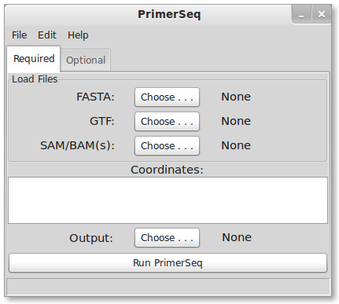
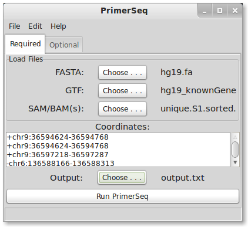
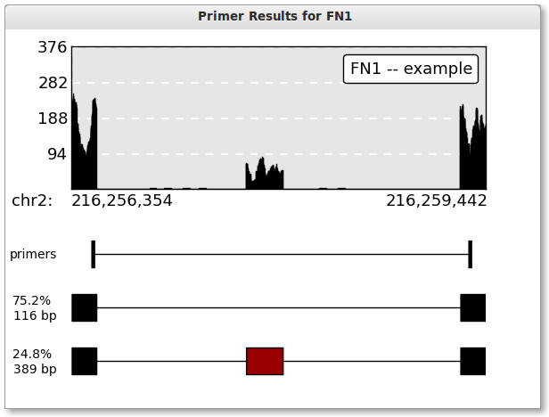



## Installation
1. You will need to have installed the [Java JRE](http://www.oracle.com/technetwork/java/javase/downloads/java-se-jre-7-download-432155.html).
You may already have Java installed, in which case proceed to step two.
2. Download the latest version from [sourceforge](http://sourceforge.net/projects/primerseq/files/)
3. Double click the download to start the installation process.
4. Click the "next" button until installation is finished.
5. You should now be able to double click a desktop icon to start PrimerSeq.

## Running PrimerSeq 
1. Load files
2. Enter target coordinates
3. Edit options (optional)
4. Select output file
5. Run PrimerSeq
6. Plot Results (optional)

## 1. Load Files

Press the "Choose . . ." buttons which are highlighted below.

### FASTA
You will need to download your own genome sequence in FASTA format.
If you are not using linux, I recommend downloading sequences from [Ensembl](http://www.ensembl.org/info/data/ftp/index.html).
Generally the FASTA files will be compressed so you will need to uncompress the sequences either via command line or using a graphical interface
like [7-Zip](http://www.7-zip.org/) (7-Zip is Windows only).

### GTF
PrimerSeq uses gene annotation in GTF format. Ultimately, the choice of where you obtain the GTF is up to you. You could download GTFs known to work from
the PrimerSeq sourceforge website, download GTFs from UCSC or Ensembl, or use GTF output from transcript assemblers like [Cufflinks](http://cufflinks.cbcb.umd.edu/).
You can also mix several GTF files into a single input GTF file for PrimerSeq! For more detailed explanations please click [here](gtf.html).

### SAM/BAM file
You can specify one or multiple SAM or BAM files as input. Make sure to hold down the ctrl key to select multiple files. SAM/BAM files are the typical output format from read aligners like [Tophat](http://tophat.cbcb.umd.edu/).
The SAM/BAM file allows PrimerSeq to estimate the relative abundance of different isoforms. If you know your BAM file is sorted (like the output from Tophat)
then please name the BAM file with a `.sorted.bam` extension so PrimerSeq does not try to re-sort the file.

## 2. Enter Targets

Fill in targets, preferably exon coordinates but not necessarily.

### Coordinate Format
Enter target coordinates as (strand)chr:start-end as seen above. The first nucleotide on a chromosome is at position 0. The end position is
not inclusive.

## 3. Edit Options

Edit optional parameters in the optional tab.

### Option Descriptions
* *PSI:* minimum inclusion level where a primer is allowed to be placed on that exon
* *Type:* source for defining exon junctions
* *Gene ID:* flag for whether the GTF has a valid Gene ID
* *Keep Temporary:* flag for keeping temporary files created when running PrimerSeq
* *Read Threshold:* minimum read count necessary to define a novel junction from RNA-Seq
* *Anchor Length:* minimum number of bases on both sides of a junction for a read to be considered valid
* *Min. Jct Count:* assign at least this number of reads to a junction known in the GTF annotation

### Primer3 Options
You can also specify the paramaters to Primer3 by clicking *Edit* and then *Primer3*. "primer3.txt" should
now open in your default text editor. You should modify the configuration file in concordance with the Primer3 manual
io version 3. You can view the Primer3 manual in the *Primer3 Doc.* option under the *View* menu. The first few lines of primer3.txt are shown below.


###########################################
# When running primer3, PrimerSeq will use the
# below primer3 options. If an option is left
# empty, then PrimerSeq relies on primer3's
# default values. Note, the GUI changes options
# by saving the options to this config file. 
# Do not add additional parameters!!!!
###########################################
PRIMER_DNA_CONC=
PRIMER_MAX_END_GC=
PRIMER_PAIR_WT_PRODUCT_SIZE_LT=
PRIMER_DNTP_CONC=
PRIMER_MAX_END_STABILITY=
PRIMER_PAIR_WT_PRODUCT_TM_GT=
PRIMER_MAX_GC=69
PRIMER_PAIR_WT_PRODUCT_TM_LT=
PRIMER_FIRST_BASE_INDEX=
PRIMER_PAIR_WT_TEMPLATE_MISPRIMING=


## 4. Select Ouput

Select the output text file.

## 5. Run PrimerSeq

Press the "Run PrimerSeq" button

A dialog should appear letting you know that PrimerSeq is designing the primers. Once PrimerSeq
is finished the dialog will disappear and you can find your output as specified in the **4. Select Output** step.

## 6. Plot Results
After running PrimerSeq you can plot the results by navigating to <i>View -> Plot</i>. A dialog should appear
as shown below.

Open plot dialog by <i>View -> Plot</i>

You will need a BigWig file(s) for plotting the results (see more information below). Note, you may specify more
than one BigWig file by selecting multiple files in the file chooser. Also you should specify
one of the targets you wish to plot in the drop down list.

### BigWig 
BigWig files store the read depth at positions in the genome. BigWig is a common custom track format used to display RNA-Seq
information. Likely if you have a custom track that displays read depth in the USCS browser (or any other genome browser) than
some one has already created a BigWig file for you.

### Generating the Plot
Press the plot button when you are ready. The button should be disabled and say "Ploting . . ." while PrimerSeq is creating your plot.
Once PrimerSeq is finished, a plot window should appear as shown below.

