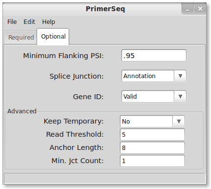



## Installation
1. You will need to have installed the [Java JRE](http://www.oracle.com/technetwork/java/javase/downloads/java-se-jre-7-download-432155.html).
You may already have Java installed, in which case proceed to step two.
2. Download the latest version from [sourceforge](http://sourceforge.net/projects/primerseq/files/)
3. Double click the download to start the installation process.
4. Click the "next" button until installation is finished.
5. You should now be able to double click a desktop icon to start PrimerSeq.

## Running PrimerSeq 
1. Load files
2. Enter target coordinates
3. Edit options (optional)
4. Select output file
5. Run PrimerSeq

## 1. Load Files

Press the "Choose . . ." buttons which are highlighted below.

### FASTA
You will need to download your own genome sequence in FASTA format.
If you are not using linux, I recommend downloading sequences from [Ensembl](http://www.ensembl.org/info/data/ftp/index.html).
Generally the FASTA files will be compressed so you will need to uncompress the sequences either via command line or using a graphical interface
like [7-Zip](http://www.7-zip.org/) (7-Zip is Windows only).

### GTF
PrimerSeq uses gene annotation in GTF format. You can download GTF gene annotations from UCSC's [table browser](http://genome.ucsc.edu/cgi-bin/hgTables?command=start).
However, UCSC does not provide valid gene id's (they fill in gene ids as transcript ids) so if you use this choice you will need to select gene id as
"not valid" in the optional tab of the GUI. Alternatively, you could download GTF files from [Ensembl](http://www.ensembl.org/info/data/ftp/index.html)
which does have valid gene ids. If your species is poorly annotated you may also use the GTF file output from transcript assemblers like [Cufflinks](http://cufflinks.cbcb.umd.edu/).

### SAM/BAM file
You can specify one or multiple SAM or BAM files as input. Make sure to hold down the ctrl key to select multiple files. SAM/BAM files are the typical output format from read aligners like [Tophat](http://tophat.cbcb.umd.edu/).
The SAM/BAM file allows PrimerSeq to estimate the relative abundance of different isoforms. If you know your BAM file is sorted (like the output from Tophat)
then please name the BAM file with a `.sorted.bam` extension so PrimerSeq does not try to re-sort the file.

## 2. Enter Targets

Fill in targets, preferably exon coordinates but not necessarily.

### Coordinate Format
Enter target coordinates as (strand)chr:start-end as seen above. The first nucleotide on a chromosome is at position 0. The end position is
not inclusive.

## 3. Edit Options

Edit optional parameters in the optional tab.

### Option Descriptions
* *PSI:* minimum inclusion level where a primer is allowed to be placed on that exon
* *Type:* source for defining exon junctions
* *Gene ID:* flag for whether the GTF has a valid Gene ID
* *Keep Temporary:* flag for keeping temporary files created when running PrimerSeq
* *Read Threshold:* minimum read count necessary to define a novel junction from RNA-Seq
* *Anchor Length:* minimum number of bases on both sides of a junction for a read to be considered valid
* *Min. Jct Count:* assign at least this number of reads to a junction known in the GTF annotation

## 4. Select Ouput

Select the output text file.

## 5. Run PrimerSeq

Press the "Run PrimerSeq" button

