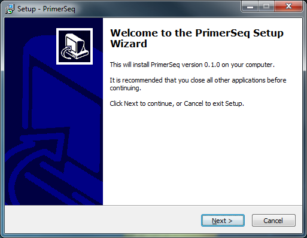
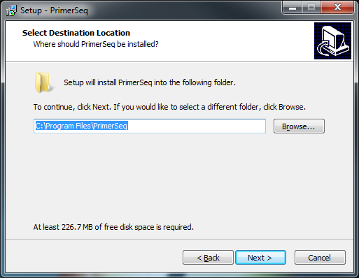
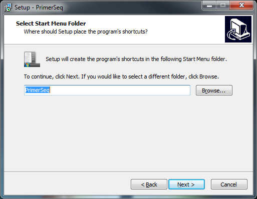
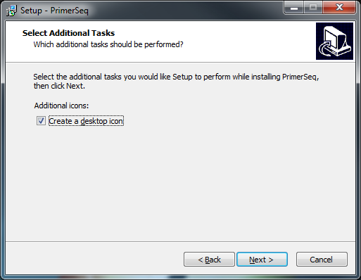
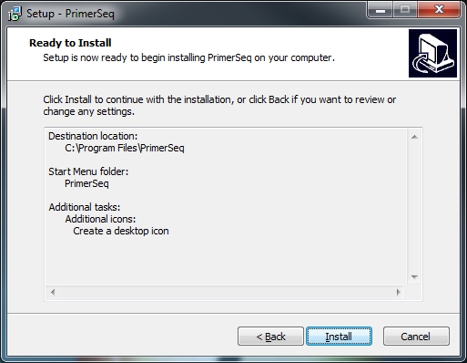
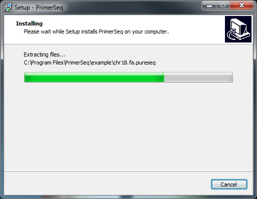
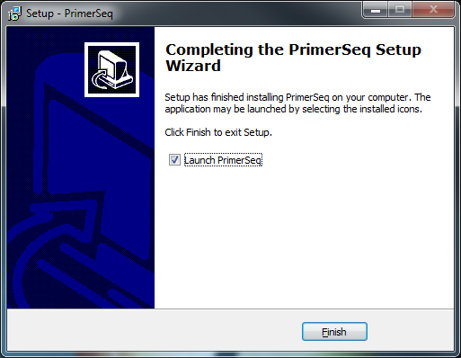



First, the [Java JRE](http://www.oracle.com/technetwork/java/javase/downloads/java-se-jre-7-download-432155.html) must be installed on your computer. 
Next, you will need to download the latest version of PrimerSeq from the sourceforge [download page](http://sourceforge.net/projects/primerseq/files/PrimerSeq).
Downloads with *"win32"* in the name are for windows. Double click the download when finished. You should now see the below installer appear.

Click Next to continue

 

Press next to continue. The installer will now allow you to select the installation directory.

Click next to accept default installation directory

 

Press next to continue. The installer will now allow you to change the shortcut name.

Click next to continue

 

Click next to continue. If you do not want a desktop icon, uncheck the checkbox.

Click next to continue

 

Click next to continue. This brings the installer to the last step before installation.

Click Install to start installtion of PrimerSeq

 

Click Install to start the installation. Installation may take a few minutes.

Wait for installation to complete

 

When the installation is complete, press Finish to exit the installer.

Press Finish to exit the installer

